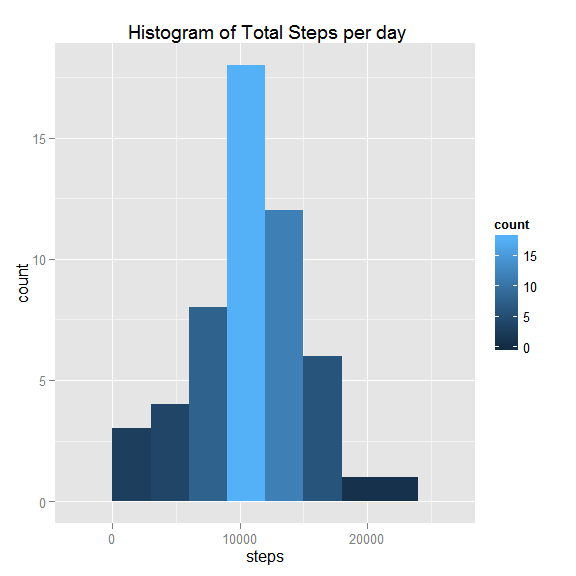
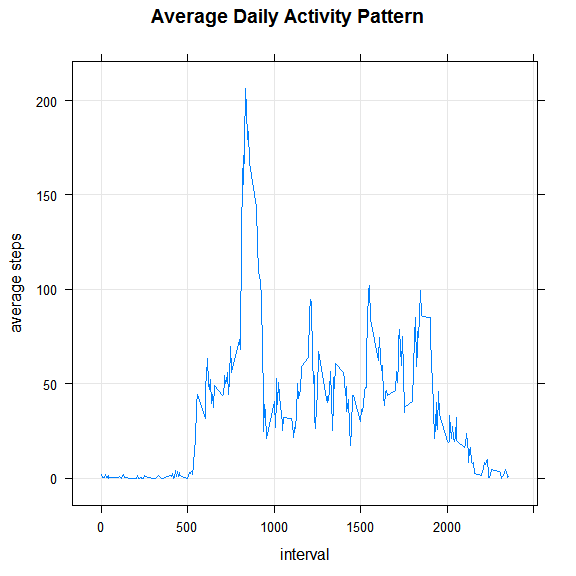
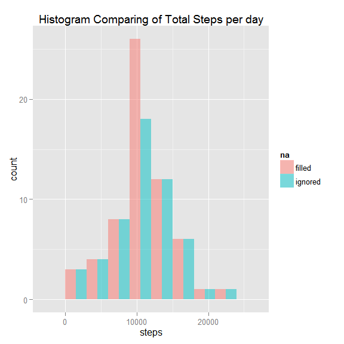
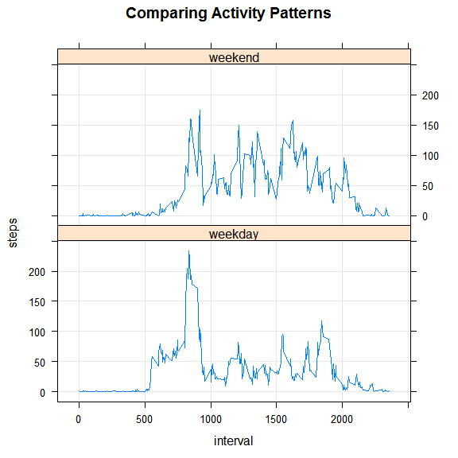

# Reproducible Research: Peer Assessment 1


## Loading and preprocessing the data

```r
options(scipen = 1, digits = 2)
library(dplyr)
library(ggplot2)
activity <- read.csv("activity.csv")
```


## What is mean total number of steps taken per day?


Let us look at a histogram of total steps taken per day.   
We ignore steps with NA value, group by day and summarize the steps.

```r
df <- activity %>%
    group_by(date) %>%
    filter(!is.na(steps)) %>%
    summarise_each(funs(sum))

g <- ggplot(df, aes(x=steps,fill=..count..))+
    geom_histogram(binwidth=3000)+
    ggtitle(" Histogram of Total Steps per day")
print(g)
```

 
   
We can get the mean median and standard deviation as followes:  

```r
mn=round(mean(df$steps))
md=round(median(df$steps))
sd=round(sd(df$steps),2)
```

The mean total number of steps taken per day **10766**  median= **10765** and sd=**4269.18** 

## What is the average daily activity pattern?
To analyze the average daily activity let us make a time series plot of the average number of steps taken, averaged across all days versus the 5-minute interval.
We ignore steps with NA value, group by interval and average the steps.


```r
library("lattice")
df <- activity %>%
    select(steps,interval) %>%
    group_by(interval) %>%
    filter(!is.na(steps)) %>%
    summarise_each(funs(mean))

xyplot(steps ~ interval, data=df,type="l",grid=TRUE,
       main="Average Daily Activity Pattern",
       ylab="average steps")
```

 

We use which() to find the 5-minute interval, on average across all the days in the dataset, that contains the maximum number of steps

```r
inter=df[which(df$steps==max(df$steps)),]$interval
```
The interval is **835** which corresponds to **206** steps

## Imputing missing values
In this section we try to device a method of dealing with  missing values (coded as NA).   
Firstly let us calculate the total number of rows containing missing values in the dataset.


```r
avgActivity <- activity %>%
    select(steps,interval) %>%
    group_by(interval) %>%
    filter(!is.na(steps)) %>%
    summarise_each(funs(mean))


onlyNA <- activity %>% filter(is.na(steps))
narows <- length(onlyNA$steps)
```
   
We find  **2304** rows containing missing values.   

###Approach for imputing missing steps values 
We replace the particular missing step value for a specific interval, with the total daily average for that interval (values found in the previous section).   

   

```r
noNA = activity %>% filter(!is.na(steps))
updated<-cbind(onlyNA,avgActivity)
updated <- updated[,c(5,2,3)]
modActivity <- rbind (noNA,updated)

sumActivity <- activity %>%
    group_by(date) %>%
    filter(!is.na(steps)) %>%
    summarise_each(funs(sum))

sumModActivity <- modActivity %>%
    group_by(date) %>%
    summarise_each(funs(sum))

mn=round(mean(sumModActivity$steps))
md=round(median(sumModActivity$steps))
sd=round(sd(sumModActivity$steps),2)

sumActivity$na='ignored'
sumModActivity$na='filled'
combActivity <- rbind(sumActivity,sumModActivity)
```
   

Shown below is a table depicting the approach.  
For every NA value we mathch the corresponding interval and replace the missing step value with the total daily average.

 missing steps       date       interval    matched interval    average steps 
---------------  ------------  ----------  ------------------  ---------------
      NA          2012-10-01       0               0                1.72      
      NA          2012-10-01       5               5                0.34      
      NA          2012-10-01       10              10               0.13      
      NA          2012-10-01       15              15               0.15      
      NA          2012-10-01       20              20               0.08      
      NA          2012-10-01       25              25               2.09      
   
Let us now plot side by side histograms of steps for NA values ignored and filled 

```r
g <- ggplot(combActivity, aes(x=steps,fill=na))+
    geom_histogram(binwidth=3000,alpha=0.5, position="dodge")+
    ggtitle("Histogram Comparing of Total Steps per day")
print(g)
```

 


The mean total number of steps taken per day **10766**  median= **10766** and sd=**3974.39** 
   
The mean was not changed by imputing missing data but the median shifted a bit.  Note also that the standard deviation is smaller which means that the distribution is more concentrated around the mean.
Overall only the counts around the mean increased significantly demonstrating that the method chosen to impute the data did not create a dramatic change in the histogram pattern, thus we can assume its was proper.


## Are there differences in activity patterns between weekdays and weekends?

Following are time series plots of the average number of steps taken versus the 5 minute interval, averaged across all weekday days or weekend days.


```r
df <- data.frame(activity,day=ifelse (weekdays(as.Date(activity$date),abbreviate =TRUE)%in% c('Sat','Sun'),'weekend','weekday'))
df <- df %>%
    select(steps,interval,day) %>%
    group_by(day,interval) %>%
    filter(!is.na(steps)) %>%
    summarise_each(funs(mean))

xyplot(steps ~ interval | day, data=df,type="l",grid=TRUE,layout=c(1,2),main="Comparing Activity Patterns")
```

 
   
Comparing the two panels we can see that on weekends there are greater number of steps in the higher intervals.  The pattern shown suggets that activity is much higher on weekends than weekdays, which is very reasonable.   
